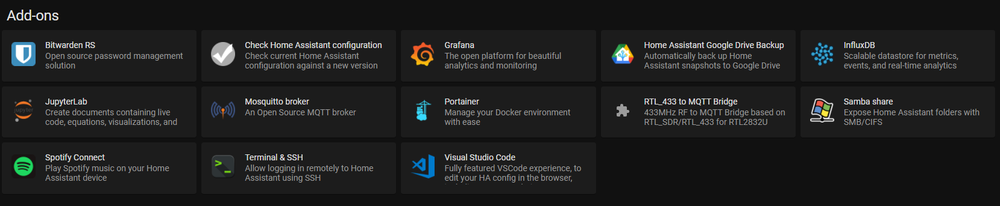
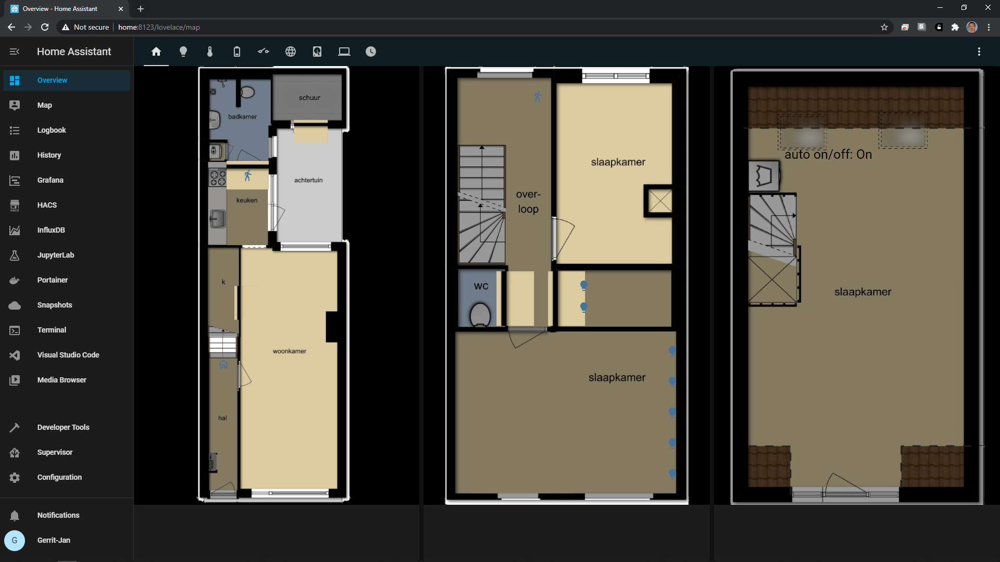
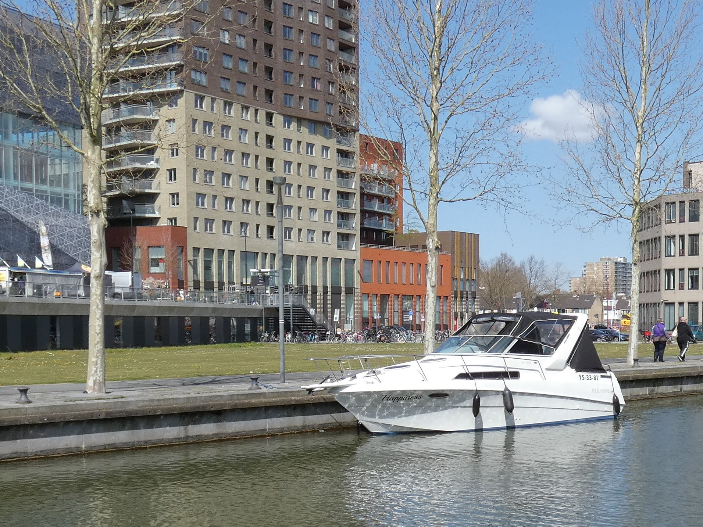

# Smarthome Cremerboulevard

This repository contains the set-up of my smart home, featured by the open-source project [Home Assistant](https://www.home-assistant.io/).

The full configuration till what it is today, took around one year of hobby time.
This is mainly because over time new devices were added.
I feel it is a steady situation and I expect that not much devices will be added in foreseeable future.
Hence, it is a good time to put the code on Github and do some version control.

If you have any questions regarding my set-up or smarthomes in general, feel free to [contact](mailto:gerritjandebruin@gmail.com) or use the [issue](https://github.com/gerritjandebruin/home-assistant/issues/new) functionality!

## The house
The house is situated in Utrecht in a district called [New-England, Utrecht](https://nl.wikipedia.org/wiki/Nieuw_Engeland,_Thomas_%C3%A0_Kempisplantsoen_en_omgeving).
More specifically, I live at the Cremerstraat, a beautiful street with sights over the most busy railroad track in the Netherlands and only a ten-minute walk from the city center.1
The house was build around 1910 and had originally a ground level and one floor.
Over the years, toilets, bathroom, second floor (2017), a roof terrace (2020) and a bike shed (2020) were added.

Aerial photo of Utrecht around 1930. The arrow marks our street. On the right, we observe the Dom tower, which can be seen from the house as well. [Source](https://hetutrechtsarchief.nl/collectie/2C8CA0EEF8605EE4B7786F7C60876957).

## Devices
The following table will provide the devices used by the home automation.
When buying new devices, I try to optimize the following:
* Limit the number of different manufacturers. This helps when later replacing devices and to get more reproducible readings.
* Money. I am not willing to spend too much extra money for just little value.
* Protocol, I try to stick to Zigbee as much as possible. Zigbee provides good coverage while not interfering with the WiFi and hence internet via laptops/ mobile phones.

Hence, most devices come from the IKEA :)
Also, since I try to limit spending, there is no smart climate, smart keys or everywhere RGB leds.

| Device            | Manufacturer      | Model                                       | Protocol                                                                                     | Price  | Pcs  | Link                                                                                                                                          |
|-------------------|-------------------|---------------------------------------------|----------------------------------------------------------------------------------------------|--------|------|-----------------------------------------------------------------------------------------------------------------------------------------------|
| Control outlet    | IKEA              | TRÅDFRI                                     | Zigbee                                                                                       | €10    | 1    | [ikea.com](https://www.ikea.com/nl/en/p/tradfri-wireless-control-outlet-90356166/)                                                            |
| Dimmer            | Philips           | Hue                                         | Zigbee                                                                                       | €20    | 1    | [mediamarkt.nl](https://www.mediamarkt.nl/nl/product/_philips-hue-white-ambiance-starterkit-inclusief-dimmer-switch-e27-1522070.html)         |
| Door sensor       | Aqara             |                                             | Zigbee                                                                                       | €44    | 5    | [aliexpress.com](https://aliexpress.com/item/4001241581941.html)                                                                              |
| Doorbell          | KIKA              | ACDB-6600AC                                 | RTL-SDR / MQTT                                                                               | €25    | 1    | [gamma.nl](https://www.gamma.nl/assortiment/klikaanklikuit-deurbel-set-acdb-6600ac/p/B413295)                                                 |
| Flower sensor     | Vegtrug           |                                             | Bluetooth                                                                              | €19    | 1    | [aliexpress.com](https://nl.aliexpress.com/item/1005001671394326.html?spm=a2g0s.9042311.0.0.71494c4dbKexmG)                                   |
| Heater            | EUROM             | CK2003 Turbo 2000W                          | via outlet                                                                                   | (€29)  | 1    | [hornbach.nl](https://www.hornbach.nl/shop/EUROM-Convectorkachel-CK2003-Turbo-2000-Watt/8438008/artikel.html)                                 |
| LED + 200W power  |                   | 24V RGB/ White spectrum 19W/m IP67 960lmn/m | via driver                                                                                   | €188   | 10m  | [led-gigant.nl](https://www.led-gigant.nl/product/24volt-rgbww-led-strip-ip66/)                                                               |
| LED + 50W power   |                   | 24V LED 12W IP65 1260lmn/m 2700K            | via shelly                                                                                   | €41    | 2.5m | [led-gigant.nl](https://www.led-gigant.nl/product/waterdichte-led-strip-extra-warm-wit-12w-1260lm-meter-24vdc-ip68-nano-3000k-25m-rol-kopie/) |
| LED driver        | GLEDOPTO          | GL-C-007                                    | Zigbee                                                                                       | €29    | 1    | [gledopto.eu](https://www.gledopto.eu/led-controller-zigbee-compatible-eng)                                                                   |
| Light bulb        | IKEA              | TRÅDFRI GU10 400lmn 2700K                   | Zigbee                                                                                       | €14    | 2    | [ikea.com](https://www.ikea.com/nl/nl/p/tradfri-led-lamp-gu10-400-lumen-draadloos-dimbaar-warm-wit-60420041/)                                 |
| Light bulb        | IKEA              | TRÅDFRI GU10 White spectrum                 | Zigbee                                                                                       | €80    | 5    | [ikea.com](https://www.ikea.com/nl/en/p/tradfri-led-bulb-gu10-400-lumen-wireless-dimmable-white-spectrum-90408603/)                           |
| Light bulb        | Philips           | Hue E14 Ambiance White spectrum             | Zigbee                                                                                       | €45    | 2    | [mediamarkt.nl](https://www.mediamarkt.nl/nl/product/_philips-hue-ambiance-2-pack-wit-1502337.html)                                           |
| Light bulb        | Philips           | Hue E27 Ambiance White spectrum             | Zigbee                                                                                       | €130   | 3    | [mediamarkt.nl](https://www.mediamarkt.nl/nl/product/_philips-hue-white-ambiance-starterkit-inclusief-dimmer-switch-e27-1522070.html)         |
| Light bulb        | Philips           | Hue E27 Filament Dimmable 7W                | Zigbee                                                                                       | €20    | 1    | [gamma.nl](https://www.gamma.nl/assortiment/philips-hue-filament-led-lamp-e27-7w/p/B128025)                                                   |
| Mobile phone      | Apple             | iPhone                                      | [iOS app](https://apps.apple.com/nl/app/home-assistant/id1099568401)                         | -      | 1    |                                                                                                                             |                 
| Motion sensor     | IKEA              | TRÅDFRI                                     | Zigbee                                                                                       | €39    | 3    | [ikea.com](https://www.ikea.com/nl/nl/p/tradfri-draadloze-bewegingssensor-wit-70429913/)                                                      |
| Motion sensor     | Philips           | Hue, w/ thermometer                         | Zigbee                                                                                       | €40    | 1    | [mediamarkt.nl](https://www.mediamarkt.nl/nl/product/_philips-hue-bewegingssensor-1522068.html)                                               |
| NAS               | Synology          | DS216play                                   | [API](https://github.com/home-assistant/core/tree/dev/homeassistant/components/synology_dsm) | (€250) | 1    | [tweakers.net](https://tweakers.net/pricewatch/461480/synology-diskstation-ds216play.html)                                                    |
| Printer           | Canon             | MG3650S                                     | IPP (WLAN)                                                                                   | (€74)  | 1    | [Canon.nl](https://www.canon.nl/printers/pixma-mg3650s/)                                                                                      |
| RTL-SDR           | RTL Cube          | 820T2                                       | Zigbee                                                                                       | €12    | 1    | [aliexpress.com](https://aliexpress.com/item/32476877972.html)                                                                                |
| Relay             | Shelly            | 1PM                                         | Zigbee                                                                                       | €25    | 2    | [shelly.cloud](https://shop.shelly.cloud/shelly-1pm-wifi-smart-home-automation-1)                                                             |
| Relay             | Shelly            | 2.5                                         | Zigbee                                                                                       | €17    | 1    | [shelly.cloud](https://shop.shelly.cloud/shelly-2.5-ce-ul-wifi-smart-home-automation)                                                         |
| Remote control    | IKEA              | TRÅDFRI                                     | Zigbee                                                                                       | €15    | 1    | [ikea.com](https://www.ikea.com/nl/en/p/tradfri-remote-control-30443124/)                                                                     |
| Router            | Sitecom           | X4 N300                                     | SNMP, UPnP                                                                                   | €50    | 1    | [sitecom.com](https://www.sitecom.com/nl/n300-wi-fi-gigabit-router-x4/wlr-4100/p/1585)                                                        |
| Router            | ZTE               | H369A / Experia Box v10                     | SNMP, UPnP                                                                                   | -      | 1    | [hardware.info](https://nl.hardware.info/routers.9/zte-kpn-experia-box-v10.280129)                                                            |
| Thermometer       | Aqara             | w/ humidity, pressure                       | Zigbee                                                                                       | €43    | 5    | [aliexpress.com](https://aliexpress.com/item/32888389905.html)                                                                                |
| Thermometer       | TuYa              | TS0201, w/ humidity and display             | Zigbee                                                                                       | €16    | 1    | [aliexpress.com](https://aliexpress.com/item/4001179535195.html)                                                                              |
| Wireless dimmer   | IKEA              | TRÅDFRI                                     | Zigbee                                                                                       | €14    | 2    | [ikea.com](https://www.ikea.com/nl/en/p/tradfri-wireless-dimmer-white-70408595/)                                                              |
| Zigbee controller | Texas Instruments | CC2531                                      | [ZHA](https://www.home-assistant.io/integrations/zha/)                                       | €10    | 1    | [tweakers.net](https://tweakers.net/aanbod/2522130/cc2531-zigbee-usb-stick-zigbee2mqtt-met-antenne.html)                                      |

- Total costs (ignoring prices in brackets): €911 

## Hardware experiences
### LED
We bought a LED strip + power supply + driver for both the bike shed and roof terrace at led-gigant.nl.
The LED at the bike shed was easy to install, since we only had to cut but not to join any strips. 
The controlling of this light strip is done by a Shelly, which are great drivers as they are easy to install and just work out-of-box on WiFi.

The installation of the LED at the roof terrace was way harder and took us several weeks!
Since our roof terrace is 4*2 meters, we needed 10m of LED strips (4+2+4 for three sides).
The LED strips were delivered as two 5m long strips, so we had to cut and reconnect them.
We did totally not expect that this would be so hard.
Since these strips are RGBWW, 5 strands needed to be connected at each joint.
Led-gigant.nl delivered some connectors for this (https://www.led-gigant.nl/led/led-accessoires/led-strip-connectors/) but we did not get them to work on all five strands simultanously.
Hence, we need to solder the connections, which is really hard given that the strands are only 1-2mm apart.

### IKEA
The IKEA devices are all of good quality, especially for the low price they are sold.
Lights are good and the remotes all work very well.
The motion sensor reports motion very fast, maybe even a bit too fast.
Especially on warmer days (>20 degrees Celsius), it triggers sometimes at random.
Major drawback is the difficulty to pair them; the only thing which works for the lights is by manually powercycle them.
As the IKEA manual is not very accurate on how to this, I used the instructions at https://www.youtube.com/watch?v=mJm9YpPrGzk (especially see the commend of Jon B.).

### Vegtrug
I like the idea of a flower sensor very much, so that is the reason I paid this relatively expensive gadget.
I will use it to monitor a citrus plant that is not doing so well :)
Is is a pity that it does not work on Zigbee, so for the moment I monitor this device via the Vegtug app.
This worked only on Android 8 and not on Android 10 for some reason.
The provided database of over 6000 flowers looks impressive!

### TuYa temperature sensor
Nice thermometer with a display that shows the temperature and humidity.
Updates very fast (over Zigbee) when temperature changes.
Major drawback: very limited battery-life of 1-2 weeks.

### Aqara
Both the temperature sensors and door sensors work very well on Zigbee with either Zigbee2MQTT or ZHA.
Battery life is around 6-12 months.

### Others
Feel free to ask more experiences by opening an [issue](https://github.com/gerritjandebruin/home-assistant/issues/new)!

## Software

Most notably, the "RTL_433 to MQTT bridge" is used together with a simple RTL-SDR receiver to capture the 433 MHz signal from the KIKA doorbell.
This add-on is provided in https://github.com/gerritjandebruin/home-assistant-kaku-doorbell.

Grafana is used to create this (among others) this cool dashboard.
https://grafana.nieuw-engeland.nl/api/hassio_ingress/oeWOgZuwtaX47_fzPYy3S15XMvx87simyZc6dG8mj6o/d/a9NUH8xGk/solar-panels?orgId=1&from=1604242079565&to=1619876879565

## Screenshots
See the `img/` directory!

## Plans
- [x] Add bike shed controls to frontend.
- [x] Add button to control lights in bike shed.
- [x] Add Home Assistant app to my Nokia 7.2.
- [x] Add some screenshots to this repo.
- [x] Make doorbell working again.
- [x] Add some info about Docker images/ addons used.
- [ ] Add flower sensor to Home Assistant
- [ ] Add section about experiences on some devices.
- [ ] Add pipeline tests to this repo.
- [ ] Learn how to write own Python code for visualizations in Lovelace. This could help to see how much each lamp was on in the past $x$ days.
- [x] Add doorsensor to bathroom.
- [ ] Make this as well for our boat!

1 This claim needs still some verification. At least the corridor Utrecht - Amsterdam/ Schiphol/ Den Haag/ Rotterdam/ Leiden/ Amersfoort/ Baarn is running at this place. That makes more than one train per minute.
