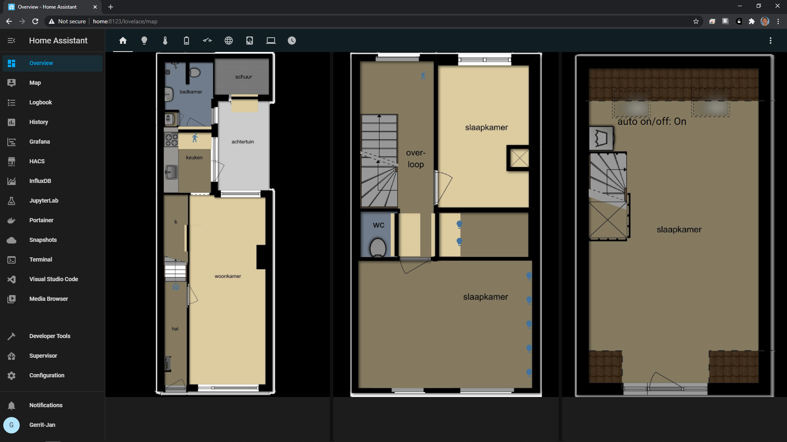

# Smarthome Cremerboulevard

This repository contains the set-up of my smart home, featured by the open-source project [Home Assistant](https://www.home-assistant.io).

I started around the beginning of the COVID pandemic with a few Philips Hue light bulbs, and the setup has grown from there.
The full configuration till what it is today, took several years of hobby time.
This is mainly because we increased the number of devices over time.
I use Github for version control and to share my configuration with others.

If you have any questions about my set-up or smarthomes in general, feel free to [contact](mailto:gerritjandebruin@gmail.com) or use the [issue](https://github.com/gerritjandebruin/home-assistant/issues/new) functionality!

## The house
The house is situated in Utrecht in a district called [New-England, Utrecht](https://nl.wikipedia.org/wiki/Nieuw_Engeland,_Thomas_%C3%A0_Kempisplantsoen_en_omgeving).
More specifically, we live at the Cremerstraat, a beautiful street with sights over the most busy railroad track in the Netherlands and only a ten-minute walk from the city center.
The house was built around 1920 and had originally a ground level and one floor.
Over the years, toilets, bathroom, second floor (2017), a roof terrace (2020) and a bike shed (2020) were added to the house.


Aerial photo of Utrecht around 1930. The arrow marks our street. On the right, we observe the Dom tower, which can be seen from the house as well. [Het Utrechts Archief](https://hetutrechtsarchief.nl/collectie/2C8CA0EEF8605EE4B7786F7C60876957).

### Rooms by floor

```
Attic (2nd floor)
│
1st floor  ──  Landing
│              Bathroom
│              Bedroom
│              Guest room
│              Roof terrace
│              Storage room
│
Ground floor ─ Hallway
│              Kitchen
│              Living room
│              Toilet
│              Walk-in closet
│              Meter cupboard
│
Outbuildings ─ Bike shed
               Shed
```

## Devices
The following table provides the devices used by the home automation.
When buying new devices, I try to keep the following matters into consideration:
* Limit the number of different manufacturers. This helps when later replacing devices and to get more reproducible readings. I prefer manufacturers that are fairly large and have a good track record in long-term availability.
* Money. I am not willing to spend too much extra money for just little value.
* Protocol, I am transitioning from Zigbee to [Matter](https://csa-iot.org/all-solutions/matter/), preferring Matter over Thread above Matter over WiFi. Thread devices form a low-power mesh network and do not congest the WiFi. The Google Nest Hub (2nd gen) acts as a Thread border router, bridging Thread devices to the IP network.

Hence, most devices come from the IKEA :)
I prefer durability over low cost, so I tend to avoid cheap disposable hardware.

| Device | Manufacturer & Model | Protocol | Room | Price | Pcs |
|--------|----------------------|----------|------|-------|-----|
| Air quality sensor | [Apollo Automation AIR-1](https://apolloautomation.com/products/air-1) | WiFi (ESPHome) | Living room | €187 | 1 |
| Air quality sensor | [MoreSense MS05](https://www.moresense.nl) (CO₂, temp, humidity) | MQTT | Bedroom, Attic | - | 2 |
| Control outlet | [IKEA TRÅDFRI](https://www.ikea.com/nl/en/p/tradfri-wireless-control-outlet-90356166/) | Zigbee | | discontinued | 1 |
| Control outlet | [IKEA Askvader](https://www.ikea.com/nl/en/p/askvaeder-on-off-switch-50463880/) | Zigbee | Attic | discontinued | 3 |
| Dehumidifier | Qlima D 820 A | WiFi (via Sonoff Basic relay; Tuya Local disabled) | | - | 1 |
| Dimmer | [Philips Hue RWL022](https://www.philips-hue.com/nl-nl/p/hue-dimmer-schakelaar/8719514274617) | Zigbee | | €20 | 1 |
| Door sensor | [Aqara lumi.sensor_magnet.aq2](https://aliexpress.com/item/4001241581941.html) | Zigbee | Bathroom, Hallway, Walk-in closet, Shed, Toilet, Storage room | €16 | 6 |
| Energy meter | [Shelly EM](https://shop.shelly.cloud/shelly-em-wifi-smart-home-automation) | WiFi | Meter cupboard | €60 | 1 |
| ESP32 | [Espressif ESP32-WROOM-32D](https://nl.aliexpress.com/item/32864722159.html) | Bluetooth & WiFi | | €15 | 1 |
| EV charger | [Peblar WLAC1-S22RPWELMDR00](https://www.peblar.com) | WiFi | Meter cupboard | - | 1 |
| Flood sensor | [Shelly Flood Gen4](https://www.shelly.com/products/shelly-flood-generation-4) | WiFi | | €35 | 1 |
| Flower sensor | [Vegtrug](https://nl.aliexpress.com/item/1005001671394326.html) | Bluetooth (via ESP32) | | €30 | 1 |
| Google Nest Hub | [Google Nest Hub 2nd gen](https://store.google.com/nl/product/nest_hub_2nd_gen) | Thread border router | Living room | (€105) | 1 |
| Heater | [EUROM CK2003 Turbo 2000W](https://www.hornbach.nl/shop/EUROM-Convectorkachel-CK2003-Turbo-2000-Watt/8438008/artikel.html) | via smart plug (HA Climate) | | (€37) | 1 |
| LED + 200W power | [24V RGBWW 19W/m IP67](https://www.led-gigant.nl/product/24volt-rgbww-led-strip-ip66/) | via Shelly RGBW2 | Roof terrace | €188 | 10m |
| LED + 50W power | [24V LED 12W IP65 2700K](https://www.led-gigant.nl/product/waterdichte-led-strip-extra-warm-wit-12w-1260lm-meter-24vdc-ip68-nano-3000k-25m-rol-kopie/) | via relay | Bike shed | €41 | 2.5m |
| LED driver | [Shelly RGBW2](https://shop.shelly.cloud/shelly-rgbw2-wifi-smart-home-automation) | WiFi | Roof terrace | discontinued | 1 |
| Light bulb | [IKEA KAJPLATS GU10 CWS 470lm](https://www.ikea.com/nl/nl/p/kajplats-led-lamp-gu10-470-lumen-draadloos-dimbaar-kleurspectrum-en-wit-spectrum-60556619/) | Matter (Thread) | Bathroom | - | 4 |
| Light bulb | [IKEA KAJPLATS GU10 WS 575lm](https://www.ikea.com/nl/nl/p/kajplats-led-lamp-gu10-575-lumen-draadloos-dimbaar-wit-spectrum-70556621/) | Matter (Thread) | Kitchen | - | 3 |
| Light bulb | [IKEA TRÅDFRI GU10 WW 400lm](https://www.ikea.com/nl/nl/p/tradfri-led-lamp-gu10-400-lumen-draadloos-dimbaar-warm-wit-60420041/) | Zigbee | Walk-in closet | €13 | 2 |
| Light bulb | [IKEA TRÅDFRI GU10 WS 400lm](https://www.ikea.com/nl/en/p/tradfri-led-bulb-gu10-400-lumen-wireless-dimmable-white-spectrum-90408603/) | Zigbee | Bedroom | €13 | 5 |
| Light bulb | [Philips Hue LTA001 E27 Filament](https://www.gamma.nl/assortiment/philips-hue-filament-led-lamp-e27-7w/p/B128025) | Zigbee | Shed | €20 | 1 |
| Light bulb | [Philips Hue LTW010 E27 White Ambiance](https://www.philips-hue.com) | Zigbee | Attic | - | 1 |
| Light bulb | [Philips Hue LTW012 E14 White Ambiance](https://www.mediamarkt.nl/nl/product/_philips-hue-ambiance-2-pack-wit-1502337.html) | Zigbee | Hallway, Landing | €48 | 2 |
| Light bulb | [Philips Hue LWA004 E27 White](https://www.philips-hue.com) | Zigbee | Attic | - | 1 |
| Light strip | [Philips Hue Flux gradient lightstrip](https://www.philips-hue.com) | Zigbee | Kitchen | - | 1 |
| Light strip | [Philips Hue OmniGlow lightstrip](https://www.philips-hue.com) | Zigbee | Kitchen | - | 1 |
| Motion sensor | [IKEA TRÅDFRI](https://www.ikea.com/nl/nl/p/tradfri-draadloze-bewegingssensor-wit-70429913/) | Zigbee | Bike shed, Kitchen, Landing | €13 | 4 |
| Motion sensor | [Philips Hue SML001 w/ thermometer](https://www.mediamarkt.nl/nl/product/_philips-hue-bewegingssensor-1522068.html) | Zigbee | Hallway | €36 | 1 |
| NAS | [Synology DS216play](https://tweakers.net/pricewatch/461480/synology-diskstation-ds216play.html) | [API](https://github.com/home-assistant/core/tree/dev/homeassistant/components/synology_dsm) | Attic | (€250) | 1 |
| Printer | [Canon MG3650S](https://www.canon.nl/printers/pixma-mg3650s/) | IPP (WLAN) | Attic | (€62) | 1 |
| Relay | [Shelly 1](https://shop.shelly.cloud/shelly-1-wifi-smart-home-automation) | WiFi | Bike shed | discontinued | 1 |
| Relay | [Shelly 1 Mini Gen4](https://www.shelly.com/products/shelly-1-mini-generation-4) | Matter (Thread) / WiFi | Hallway | €16 | 2 |
| Relay | [Shelly 1PM](https://shop.shelly.cloud/shelly-1pm-wifi-smart-home-automation-1) | WiFi | Toilet, Living room | discontinued | 2 |
| Relay | [Shelly 1PM Mini Gen4](https://www.shelly.com/products/shelly-1pm-mini-generation-4) | WiFi | Bathroom (×2), Kitchen, Living room | €18 | 4 |
| Relay | [Shelly 2.5](https://shop.shelly.cloud/shelly-2.5-ce-ul-wifi-smart-home-automation) | WiFi | Bathroom (×3) | discontinued | 3 |
| Relay | [Shelly Plug S](https://shop.shelly.cloud/shelly-plug-s-wifi-smart-home-automation) | WiFi | Walk-in closet, Kitchen, Bedroom, Attic (×4) | €20 | 7 |
| Remote control | [IKEA TRÅDFRI](https://www.ikea.com/nl/en/p/tradfri-remote-control-30443124/) | Zigbee | Bedroom | discontinued | 1 |
| Robot vacuum | Bluebot XBoost | WiFi | | - | 1 |
| Router | [ZTE H369A / Experia Box v10](https://nl.hardware.info/routers.9/zte-kpn-experia-box-v10.280129) | SNMP, UPnP | | - | 1 |
| Router | [TP-Link Archer AX55](https://www.mediamarkt.nl/nl/product/_tp-link-archer-ax55-1716886.html) | UPnP | Living room | (€51) | 1 |
| Smart plug | [NOUS A1T (Tasmota)](https://nous.technology/product/nous-a1t.html) | WiFi | Bike shed, Kitchen (×3), Shed, Living room, Attic | €25 | 7 |
| Smart switch | Sonoff Basic (Tasmota) | WiFi | | - | 1 |
| Solar | Growatt ShineLan-X | LAN, MQTT (via [Grott](https://github.com/johanmeijer/grott)), [PVOutput](https://pvoutput.org/list.jsp?userid=112973) | | - | 1 |
| Switch | [TP-Link TL-SG108S](https://www.mediamarkt.nl/nl/product/_tp-link-tl-sg108s-1593913.html) | - | | (€29) | 1 |
| Tesla | [Tesla (49 kWh)](https://www.tesla.com) | via evcc | | - | 1 |
| Thermostat (CV) | [Vaillant VR940f + VRT51f](https://www.vaillant.nl) | WiFi (HomeKit) | Living room | - | 1 |
| Thermometer | [Aqara lumi.weather](https://aliexpress.com/item/32888389905.html) (w/ humidity, pressure) | Zigbee | Bathroom, Guest room, Shed | €43 | 3 |
| Thermometer | [TuYa TS0201](https://aliexpress.com/item/4001179535195.html) (w/ humidity and display) | Zigbee | Living room, Attic | €16 | 2 |
| TV | [Samsung The Frame QE50LS03](https://www.samsung.com/nl/tvs/qled-tv/the-frame-50-inch-qe50ls03aauxxn/) | WiFi | Living room | - | 1 |
| Water leak sensor | [IKEA BADRING](https://www.ikea.com/nl/nl/p/badring-watersensor-50504361/) | Zigbee | Attic | - | 1 |
| Water meter | [Muino water meter sensor](https://github.com/gerritjandebruin/watermeter-esphome) | WiFi (ESPHome) | Meter cupboard | €30 | 1 |
| Wireless dimmer | [IKEA TRÅDFRI](https://www.ikea.com/nl/en/p/tradfri-wireless-dimmer-white-70408595/) | Zigbee | Bedroom | €5 | 2 |
| Zigbee controller | [dresden elektronik ConBee II](https://phoscon.de/en/conbee2) | [ZHA](https://www.home-assistant.io/integrations/zha/) | Shed | €35 | 1 |

- Total costs (ignoring prices in brackets): ~€1,179

## Hardware experiences
### LED
We bought a LED strip + power supply + driver for both the bike shed and roof terrace at led-gigant.nl.
The LED at the bike shed was easy to install since we only had to cut but not to join any strips. 
The controlling of this light strip is done by a Shelly, which are great drivers as they are easy to install and just work out-of-box on WiFi.

The installation of the LED at the roof terrace was harder and took us several weeks!
Since our roof terrace is 4*2 meters, we needed 10m of LED strips (4+2+4 for three sides).
The LED strips were delivered as two 5m long strips, so we had to cut and reconnect them.
We did not expect that this would be so hard.
Since these strips are RGBWW, 5 strands needed to be connected at each joint.
We bought some [non-solder connections](https://www.led-gigant.nl/led/led-accessoires/led-strip-connectors/) from Led-gigant.nl but we did not get them to work on all five strands simultaneously.
Hence, we need to solder the connections, which is hard given that the strands are only 1-2mm apart.

### IKEA
The IKEA devices are all good quality, especially for the low price they are sold.
Lights are good and the remotes all work very well.
The motion sensor reports motion fast, maybe even a bit too fast; especially on warmer days (>20 degrees Celsius), it triggers sometimes at random.
Major drawback is the difficulty to pair them; the only thing which works for the lights is by manually powercycle them.
As the IKEA manual is not very accurate on how to this, I used the instructions from [IKEA Switzerland](https://www.youtube.com/watch?v=mJm9YpPrGzk) (especially see the comment of Jon B.).

### Vegtrug
I like the idea of a flower sensor very much, so that is the reason I paid this relatively expensive gadget.
I will use it to monitor a citrus plant that is not doing so well :)
It works via Bluetooth Low-Energy so I monitor this device with an ESP32 using [ESPHome](https://esphome.io/components/sensor/xiaomi_ble.html?highlight=flower).
An open-source database for the Vegtrug can be found at https://open.plantbook.io/.

### TuYa temperature sensor
Nice thermometer with a display that shows the temperature and humidity.
Updates very fast (over Zigbee) when temperature changes.
Major drawback: very limited battery-life of 1-2 weeks.

### Aqara
Both the temperature sensors and door sensors work very well on Zigbee with either Zigbee2MQTT or ZHA.
Battery life is around 6-12 months.

### Apollo AIR-1
The Apollo AIR-1 is an all-in-one air quality sensor for the living room.
It measures CO₂, temperature, humidity, and particulate matter (PM), and runs on ESPHome over WiFi.
Integration with Home Assistant is seamless via the native API.

### Water meter
The water meter is based on the [Muino water meter sensor](https://github.com/gerritjandebruin/watermeter-esphome) combined with an ESP32.
It reads the optical pulse from the water meter and reports water consumption to Home Assistant via ESPHome.
Works very reliably.

### EV charging with evcc
We bought a Tesla and installed a [Peblar](https://www.peblar.com) EV charger.
To charge the car using surplus solar energy, we use [evcc](https://evcc.io/), an open-source EV charging manager.
evcc integrates with the Growatt solar inverter (via Home Assistant API) and monitors grid import/export via a Shelly EM energy meter.
This allows smart charging: the car is charged preferentially with solar power, reducing grid import.

### Others
Feel free to ask more experiences by opening an [issue](https://github.com/gerritjandebruin/home-assistant/issues/new)!

## Entities
Auto-generated overviews (refresh by running the script in [CLAUDE.md](CLAUDE.md)):
- [entities.md](entities.md) — 1311 entities across 27 domains
- [devices.md](devices.md) — 153 devices grouped by integration
- [integrations.md](integrations.md) — 105 config entries

## Screenshots
See the [img/](https://github.com/gerritjandebruin/home-assistant/tree/main/img) directory!


